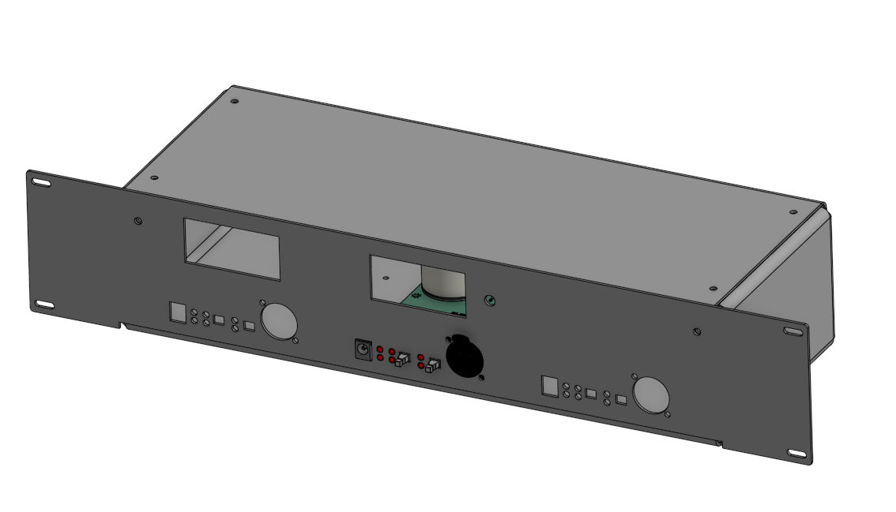
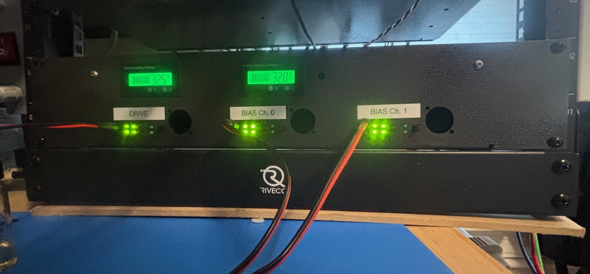

# TPA3255_ClassD_PBTL
A KiCAD project for the TPA3255 amplifier in PBTL mode

This repository contains schematics, PCB layout and documentation for a compact, rack mountable PBTL (Parallel Bridged) Class‑D amplifier based on the Texas Instruments TPA3255. The design is intended to house three amplifier modules in a single 2U rack enclosure and includes front‑panel controls such as button‑enabled DC‑coupling, balanced XLR inputs/outputs, and protection/status indicators.

## Features

- TPA3255 Class‑D amplifier modules configured in PBTL(parallel bridge-tied load) mode
- Per‑channel button to toggle DC‑coupling
- Balanced XLR inputs
- Per‑channel protection: overcurrent, overtemperature, 
- Clipping indicators
- Per‑channel status LEDs (PWR GOOD / CLIP / FAULT)
- Mechanical layout and enclosure guidance for three amplifiers in a 2U rack unit

## Key electrical parameters

- Supply voltage - 24-52V
  - Power supply current rating should be sufficient for your load. At 50V a 12A supply will be enough for any application, but less is suitable for many other applications. 
- Gain is fixed. G = 21.6(2 Ohms) to 24.4(15 Ohms)
- THD depends on amplitude/power but generally 0.1-0.5%. Better than that in some operating conditions/power levels. 
- Output noise (1-25kHz) is approximately 2 microVolts/sqrt(Hz) 
- Quiescent power draw - about 100 mA per channel

## Overview

This project is intended as a general-purpose amplifier capable of replacing the AE Techron 7224 in a variety of lower-power applications. It is a high‑efficiency, medium‑power (300 Watt for sure and up to 600W, in theory...) amplifier solution with balanced I/O and configurable output coupling. The DC‑coupling button lets users switch the amplifier output between AC coupling and DC coupling for use with audio systems or laboratory instruments, etc. that require true DC‑coupled operation. The enclosure is designed to hold three amplifier modules in a 19" 2U rack, with appropriate heatsinking and airflow considerations.

### In this repository:

 - The enclosure is in the top level as: "TPA3255PBTL_Enclosure.step" [Here](TPA3255PBTL_Enclosure.step)
 - There is an add-on board in the directory "Current Control Board" Which allows the user to configure it as a current-mode amplifier with an external current sensor (ACS711)

## Important Design Notes

- Balanced XLR pinout: Pin 1 = GND, Pin 2 = Hot (+), Pin 3 = Cold (−).

- If you enable DC‑coupling, verify output DC offset is within safe limits for connected device. For a transformer, this may be problematic. 

- XLR output: It is not a high-power connector so if the application requires high-current, it would be a good idea to solder directly to the PCB and/or rework the board for a different connector.

## Possible configurations
I designed it for two distinct applications, stepping-DC waveforms (i.e. staircase like waves), and pure sine waves. As the requirements are quite different between the two, there is two output filter configurations. For the DC staircases, the filter uses ferrite cores. For the sine waves, the output filter uses air-core inductors to minimize the risk of adding distortions. 

## Mechanical & Enclosure Guidance (3 amps in 2U rack)

- Standard 19" width, 2U height (88.9 mm). 
- Depth = 145 mm not including XLR connectors, which should have about 100 mm of space for the cable/bend
- XLR inputs on front and rear panel
- Speaker outputs on rear

## BOM notes

- Heatsink hardware = Advanced Thermal Solutions Inc. ATS-TI1OP-519-C1-R3
- Inductor core (for DC version) = Magnetics, a division of Spang & Co., 0079894A7HT19
  - Coated Kool Mu MAX Ferrite Core Toroid Type Length Width 1.060" (26.92mm) Diameter 0.708" (17.99mm) Height
  - Wind with three parallel strands of 18AWG magnet wire, 11 turns 

## Filter inductors

### High power (Lower linearity)
Using ferrite cores improves the efficiency (less copper losses) at the expense of some harmonic distortion. The first-stage core, L2 and L3, must carry the ripple current from the switching. The switching frequency is about 500 kHz (2 uSec period), so if it is switching 50 V every 1 uSec, at periodic steady state when the average voltage across the inductor is 0 V and so each half-period has 25 V across the inductor, the ripple current will be 2.5 A (di/dt = V/L = 25 / 10 uH = 2.5 A/uSec). The original inductor Bourns Inc. 2101-V-RC did not tolerate this well and increased the quiescent current to about 200 mA per channel and induced considerable losses into the system at higher currents. To reduce the inductor losses, this was replaced with the 0079894A7HT19 with 11 turns of three strands of 18AWG magnet wire. This core was chosen for the high saturation magnetization and fairly low losses. The datasheet specifies that the 20% reduction in inductance will occur with 320 Amp-turns so just about 30 Amps, which is more than the amplifier can output anyway. 

### High linearity
Ferrite inductors are inherently nonlinear, so for the applications that require high purity waveforms, an air core inductor was wound and only a single stage of output filtering. The inductor former (rectangular cylinder) is 22mm tall, 35mm OD, 12mm ID, and has 38 turns of 18 AWG magnet wire (about 3.3 m of wire with some extra to be cut off). The inductance was 10 uH and 200 mOhms at 50kHz. Litz wire would reduce the losses somewhat, but I wanted to avoid using Litz for this project. 

## Filter capacitors

The original capacitors (B32529D1105J289) are fine for low-frequency applications, but for >10 kHz, they should be replaced with ones which can tolerate the current being driven into them by the amplifier. At 25 kHz, the reactance is only 6.4 Ohms, so at 50 V there would be nearly 10 A of current flowing into the capacitors. I suggest much larger, much lower loss polypropylene film capacitors (e.g. R76 series or similar, and at least 300VAC rating). They will either need to be bodged onto the board (like I did) or rework the PCB to accomodate it. 

# Measurements

## Output power

### 2.5 Ohm load

After about 3 minutes with a 51V supply, 6 Amps being drawn (306W), the amplifier overheated. It reset via the front-panel button after cooling off.Note: there wasnt much forced air over the fins.

### 5 Ohm load
With 47 Vpk (1 kHz) into 5 Ohm load, the system reached a steady state.
- Heat sink: 67 C
- Small output inductors: 77 C

### 7.7 Ohm load
With 45.8 Vpk (1 kHz) into 7.7 Ohm load, the system reached a steady state.

## Gain

### Air core inductor output filter

### Ferrite core inductor output filter

### Low Freq characteristics, effect of jumpers on input

## THD
All measurements with the wide BW/DC enabled mode. Measured the voltage across the load with a RP1025D differential probe 20x range. The probe itself has about 0.1-0.5% THD at 1kHz. 
### Ferrite output filter, 15 Ohm load:

### Air core inductor filter, 15 Ohm load:

### Air core inductor filter, 2 Ohm load:

## Noise, input terminated, 2 Ohm load

## Safety & Compliance Notes

- DC‑coupled outputs can damage speakers/transformers/other loads if misused 
- For commercial use verify thermal/electrical safety per applicable standards (IEC/UL) and plan for certification where required.

# Schematic details:

The output filter sheet shows the post-switching LC network and probe connectors used to tame the 500 kHz ripple. It is important to keep the filter inductor above 5 uH, per the datasheet. C18/19 present low impedance at high frequencies mitigating some RF noise when the ESL of the larger capacitors would limit their effectiveness. C20/R8 stabilize the impedance at higher frequencies. 

The Second stage filter, L4/C8/C36 and its opposite pair can be included or not depending on the application. They will be a bit lossy but add additional filtering stages to mitigate higher frequency noise. These are not populated in the air core filter version becasuse that application has another filter external to this amplifier board. 

The LED page documents the front-panel status indicators, including the current-limit, clip, and fault drivers tied into the protection logic. See the datasheet for details on the logic. 

The power sheet covers the main supply routing, bulk capacitance, and bias regulation stages that feed the TPA3255 module and housekeeping rails.

Note that there is a reverse voltage protection PMOS, the Zener diode protects it from too high VGS.

There are also LEDs to indicate each of the four rails are working (well that there is power to them, they may be enabled but the rails be incorrect). 

The signals schematic captures the balanced input conditioning, relay-controlled coupling paths, etc.

The signal either passes throught the AC coupling capacitors, C15/43 (the values of which should be chosen based on the application), and are bypassed in DC coupled mode by the latching switch. It then goes through a Diff->SE stage (U4A) which sets the reference point to be 3.8V. The signal then is buffered and turned into a differential signal either going through large AC coupling caps or through jumpers J4/5 which need to be shorted for true DC coupling mode. 

RV1 allows offset trimming.

U7A/B allows for external voltage monitoring, via a home-brew high signal instrumentation amplifier setup, if needed. There is only a test point, but a wire could be easily soldered and a connector added if desired. 

The startup page highlights inrush limiting, sequencing, and reset circuitry that ensures the amplifier powers up quietly without tripping protection as suggested by the datasheet. Initially the capacitor holds Q4 low, which means Q5 is enabled, pulling the RST to gnd, but when the capacitor charges, Q4 conducts pulling the gate of Q5 down and R52 pulls RST high.

